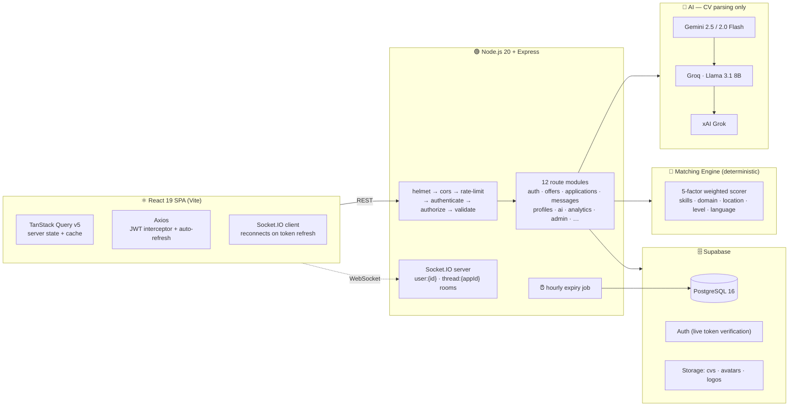
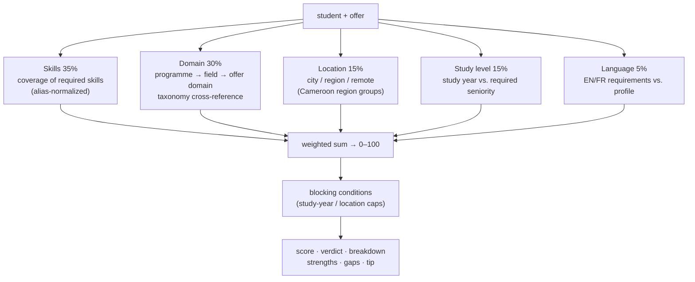
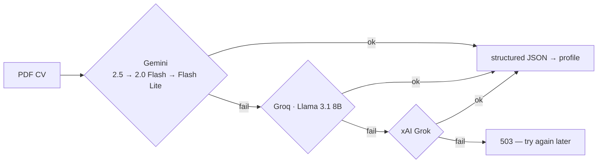
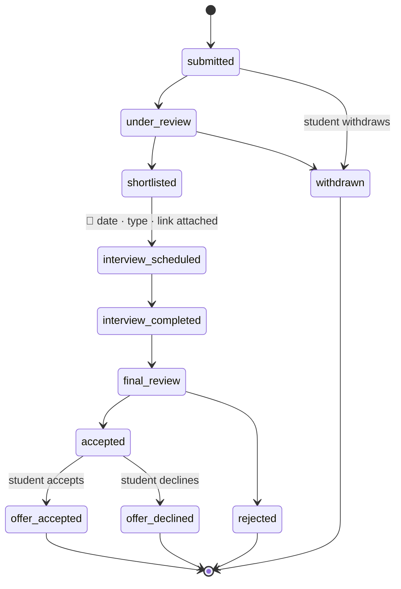

<div align="center">

# 🔦 InternBeacon

### The Internship Matching Platform for Cameroonian University Students

*Not a job board. A matching engine — a transparent, explainable algorithm that scores every student–offer pair, with real-time tracking and recruiter chat.*

[](https://github.com/mahitoh/internbeacon/actions/workflows/ci.yml)
[](https://nodejs.org)
[](https://react.dev)
[](https://supabase.com)
[](https://socket.io)
[](https://vitejs.dev)
[](https://tailwindcss.com)
[](LICENSE)

[Features](#-features) · [Architecture](#-architecture) · [Matching Engine](#-the-matching-engine) · [Quick Start](#-quick-start) · [API](#-api-reference) · [Real-Time](#-real-time-events)

</div>

---

## Why InternBeacon?

Every year, thousands of Cameroonian students hunt for internships through word of mouth, printed CVs, and unanswered emails. Companies, meanwhile, drown in unstructured applications with no way to compare candidates. **InternBeacon fixes both sides of the market.**

|  | LinkedIn | Jobberman | **InternBeacon** |
|---|:---:|:---:|:---:|
| Internship-specific | Partial | Partial | ✅ |
| Cameroonian context | ❌ | Partial | ✅ |
| Real-time application status push | ❌ | ❌ | ✅ |
| Direct student ↔ recruiter chat | ❌ | ❌ | ✅ |
| Explainable match scores & applicant ranking | ❌ | ❌ | ✅ |
| AI CV parsing | ❌ | ❌ | ✅ |
| Free for students | Partial | Partial | ✅ |

Built as a Bachelor's final-year project at **ICT University (FICT)** — engineered like a production ATS.

---

## ✨ Features

<table>
<tr>
<td width="33%" valign="top">

### 🎓 Students

- **Smart discovery** — search, filter, and a personalised *Recommended* feed ranked by algorithmic fit; every offer card shows your live match score
- **AI CV parser** — upload a PDF, get skills, education, and experience extracted into your profile
- **Explainable match score** — 0–100 compatibility against any offer, with a verdict, a per-factor breakdown, and concrete improvement tips
- **Live status tracking** — a multi-stage pipeline with a visual timeline that updates *without a page reload*
- **Direct messaging** — real-time chat with recruiters, with typing indicators and read receipts
- **Interview center** — all scheduled interviews (Google Meet, Zoom, Teams, in-person, phone) with links and reminders in one place
- **Bookmarks, analytics, profile-completeness score**

</td>
<td width="33%" valign="top">

### 🏢 Companies

- **Offer management** — post, edit, close; offers auto-expire past their deadline via a background job
- **Applicant ranking** — every applicant scored and ordered by algorithmic fit, with per-candidate reasoning
- **Structured pipeline** — move candidates through review → shortlist → interview → decision
- **Interview scheduling** — date, type (Meet/Zoom/Teams/in-person/phone), link, and notes attached to the application; student notified instantly
- **Internal notes** — private recruiter annotations, never visible to candidates
- **Immutable application snapshots** — see the profile and CV *as submitted*, even if edited later
- **Verified badge** — admin-granted trust mark on profile and offer cards
- **Hiring funnel analytics**

</td>
<td width="33%" valign="top">

### 🛡️ Admins

- **Platform statistics** — live counts across users, offers, and applications
- **User management** — activate, deactivate, change roles
- **Offer moderation** — review or remove any listing
- **Company verification** — toggle the verified badge
- **Broadcast notifications** — platform-wide announcements, delivered in real time
- **Application oversight** — full audit trail of every status change

</td>
</tr>
</table>

---

## 🏗 Architecture

A classic three-tier architecture with a real-time layer riding the same HTTP server — no extra infrastructure.



### Design decisions that matter

- **Zero custom auth code.** Every request is verified live against Supabase Auth (`supabaseAdmin.auth.getUser`) — tokens can't be forged, and revocation is instant. No homemade JWT signing, ever.
- **Authorization in middleware, not RLS.** The backend holds the service role key; access control is centralized, explicit, and testable in Express middleware.
- **Persist first, emit second.** Every real-time event (message, notification, status change) is written to PostgreSQL *before* the socket emit — history survives any disconnect or server restart.
- **Fire-and-forget side effects.** Notifications, emails, and CV snapshot copies never block or fail the primary request.
- **Immutable applications.** On submission, the student's profile and CV are snapshotted (JSONB + a per-application copy in storage). Recruiters always evaluate what was actually submitted.
- **Uniform contracts.** Every response is `{ success, data }` or `{ success: false, message }`; DB `snake_case` is normalised to client `camelCase` at the controller boundary.

---

## 🧮 The Matching Engine

InternBeacon's headline trick: **matching that is fast, free, and fully explainable.** Every student–offer pair is scored by a deterministic weighted model (`backend/src/utils/matchingEngine.js`) — no external API call, no rate limit, no black box. The same engine powers offer cards, the recommended feed, recruiter applicant ranking, and offer alerts. Every score comes with a verdict, a per-factor breakdown, and human-readable strengths, gaps, and a tip.



**Why a deterministic engine instead of an LLM?** It is instantaneous, costs nothing, never rate-limits, and — crucially for a thesis — is fully reproducible and explainable. Two robustness touches keep it fair: when a programme or offer domain can't be classified, domain's weight is redistributed to skills rather than penalizing the student; and **blocking conditions** stop one perfect factor from masking a disqualifying mismatch (e.g. a hard study-year miss caps the verdict at *Review Carefully*).

| Capability | Engine | What it does |
|---|---|---|
| **Offer Matching** | algorithmic | Scores a student against any offer (0–100) with a verdict, per-factor breakdown, and concrete tips. Shown inline on every offer card and detail page. |
| **Applicant Ranking** | algorithmic | Batch-ranks every (non-terminal) applicant on an offer for the recruiter, with per-candidate reasoning. |
| **Recommendations** | algorithmic | A personalised feed (`/api/offers/recommended`) with the reasons each offer surfaced. |
| **Offer Alerts** | algorithmic | At publish time, scores a new offer against every opted-in student and notifies those above their threshold. |
| **CV Parsing** | AI (LLM) | The one AI feature: extracts text from the stored PDF (`pdf-parse`), prompts for structured JSON — skills, education, experience, languages, summary — and enriches the student profile. |

### AI for CV parsing

CV parsing is the only feature that calls an LLM. Providers are tried in priority order; if all are down, the endpoint returns a clean `503` and the rest of the platform is unaffected (matching never depends on AI).



> Robust JSON extraction (`extractJSON`) strips model preamble before parsing, so a chatty LLM never breaks the API.

---

## ⚡ Real-Time Events

Socket.IO shares the HTTP server. Every socket is authenticated with the same live Supabase verification as REST — an unauthenticated socket never joins a room.

| Room | Members | Carries |
|---|---|---|
| `user:{userId}` | one user | notifications, status updates |
| `thread:{appId}` | student + company | chat messages, typing, read receipts |

```js
// Client → Server
socket.emit('join_thread',  appId);
socket.emit('typing', { appId, isTyping: true });

// Server → Client
socket.on('new_message',      (msg)  => { /* render instantly */ });
socket.on('new_notification', (n)    => { /* bell badge++ */ });
socket.on('user_typing',      ({ userId, isTyping }) => { /* … */ });
socket.on('messages_read',    ({ messageIds, readerId }) => { /* ✓✓ */ });
```

When an access token expires, the Axios interceptor silently refreshes it and dispatches a `token:refreshed` DOM event — the socket reconnects with the new token automatically. **Sessions never visibly break.**

---

## 🔁 Application Lifecycle

Every transition is enforced server-side, timestamped, recorded in `application_status_history`, and pushed to the other party in real time (in-app + email).



---

## 🚀 Quick Start

### Prerequisites

- Node.js 20+ and npm 9+
- A [Supabase](https://supabase.com) project (free tier works)
- At least one AI provider key — [Gemini](https://aistudio.google.com) recommended (free tier works)

### Install & Run

```bash
git clone https://github.com/mahitoh/internbeacon.git
cd internbeacon

# Backend
cd backend && npm install && npm run dev      # → http://localhost:5000

# Frontend (second terminal)
cd frontend && npm install && npm run dev     # → http://localhost:5173
```

Both servers run concurrently in development. For production: `npm run build` in `frontend/`, `npm start` in `backend/`.

### Environment Variables

**`backend/.env`**

```env
# ── Required (server refuses to start without these) ──────────
SUPABASE_URL=https://your-project.supabase.co
SUPABASE_ANON_KEY=your_anon_key
SUPABASE_SERVICE_ROLE_KEY=your_service_role_key

# ── AI providers (CV parsing only; at least one to enable it; tried in order) ─
GEMINI_API_KEY=...        # primary — Gemini 2.5/2.0 Flash
GROQ_API_KEY=...          # fallback — Llama 3.1 8B Instant
XAI_API_KEY=...           # fallback — Grok

# ── Optional ──────────────────────────────────────────────────
PORT=5000
CLIENT_URL=http://localhost:5173
SMTP_USER=your@gmail.com  # email notifications skip silently if absent
SMTP_PASS=your_app_password
```

**`frontend/.env`**

```env
VITE_API_URL=http://localhost:5000/api
VITE_SOCKET_URL=http://localhost:5000
VITE_SUPABASE_URL=https://your-project.supabase.co
VITE_SUPABASE_ANON_KEY=your_anon_key
```

---

## 📡 API Reference

> 50+ endpoints across 12 route modules. All protected routes require `Authorization: Bearer <token>`. All responses follow `{ success, data | message }`.

<details>
<summary><b>Authentication</b> — 8 endpoints</summary>

| Method | Endpoint | Auth | Description |
|--------|----------|:---:|-------------|
| POST | `/api/auth/register` | — | Register a student or company |
| POST | `/api/auth/login` | — | Login → access + refresh tokens |
| POST | `/api/auth/refresh` | — | Silent token renewal |
| POST | `/api/auth/forgot-password` | — | Request password reset email |
| POST | `/api/auth/reset-password` | — | Complete password reset |
| POST | `/api/auth/logout` | ✓ | Invalidate session |
| GET | `/api/auth/me` | ✓ | Current authenticated user |
| POST | `/api/auth/complete-profile` | ✓ | Finish onboarding |

</details>

<details>
<summary><b>Offers & Bookmarks</b> — 10 endpoints</summary>

| Method | Endpoint | Role | Description |
|--------|----------|:---:|-------------|
| GET | `/api/offers` | public* | List active offers (filter + search); *students get inline match scores |
| GET | `/api/offers/:id` | public* | Offer details; *students get a full match breakdown |
| GET | `/api/offers/recommended` | student | Personalised algorithmic feed |
| GET | `/api/offers/bookmarks` | student | Saved offers |
| POST / DELETE | `/api/offers/:id/bookmark` | student | Toggle bookmark |
| GET | `/api/offers/my` | company | Own offers |
| POST | `/api/offers` | company | Create offer |
| PATCH / DELETE | `/api/offers/:id` | company | Update / delete offer |

</details>

<details>
<summary><b>Applications</b> — 9 endpoints</summary>

| Method | Endpoint | Role | Description |
|--------|----------|:---:|-------------|
| POST | `/api/applications` | student | Apply (profile + CV snapshotted) |
| GET | `/api/applications/my` | student | Own applications |
| PATCH | `/api/applications/:id/withdraw` | student | Withdraw |
| PATCH | `/api/applications/:id/respond` | student | Accept / decline an offer |
| GET | `/api/applications/company` | company | All received applications |
| GET | `/api/applications/offer/:offerId` | company | Applications per offer |
| PATCH | `/api/applications/:id/status` | company | Advance the pipeline |
| GET | `/api/applications/:id` | any | Application details |
| GET | `/api/applications/:id/history` | any | Full status audit trail |

</details>

<details>
<summary><b>Messaging</b> — 5 endpoints</summary>

| Method | Endpoint | Description |
|--------|----------|-------------|
| GET | `/api/messages/threads` | All conversation threads |
| GET / POST | `/api/messages/app/:appId` | Read / send in a thread |
| PATCH | `/api/messages/:id/read` | Mark as read |
| GET | `/api/messages/unread-count` | Unread badge count |

</details>

<details>
<summary><b>AI & Matching</b> — 4 endpoints</summary>

| Method | Endpoint | Role | Engine | Description |
|--------|----------|:---:|:---:|-------------|
| GET | `/api/ai/providers` | any | — | Active CV-parsing provider chain |
| POST | `/api/ai/parse-cv` | student | AI | Structured extraction from PDF CV |
| GET | `/api/ai/match-offer/:offerId` | student | algorithmic | 0–100 compatibility + breakdown + tips |
| GET | `/api/ai/rank-applicants/:offerId` | company | algorithmic | Ranked applicant list |

</details>

<details>
<summary><b>Profiles, Uploads, Analytics, Companies</b></summary>

| Method | Endpoint | Role | Description |
|--------|----------|:---:|-------------|
| GET | `/api/companies/:id` | public | Public company profile |
| GET | `/api/profiles/student/:id` · `/company/:id` | ✓ | Read profiles |
| PATCH | `/api/profiles/student` · `/company` | owner | Update own profile |
| POST | `/api/upload/cv` | student | PDF, 5 MB — MIME verified by buffer inspection |
| POST | `/api/upload/avatar` · `/logo` | owner | Image, 2 MB |
| GET | `/api/upload/cv-url/:studentUserId` | ✓ | Signed CV URL (access-controlled) |
| GET | `/api/analytics` · `/analytics/company` | role | Dashboard statistics |

</details>

<details>
<summary><b>Admin</b> — 11 endpoints</summary>

| Method | Endpoint | Description |
|--------|----------|-------------|
| GET | `/api/admin/stats` | Platform-wide metrics |
| GET | `/api/admin/users` | List users |
| PATCH | `/api/admin/users/:id/activate` · `/role` | Activate / deactivate / change role |
| DELETE | `/api/admin/users/:id` | Delete user |
| GET | `/api/admin/offers` · `/applications` | Moderation lists |
| PATCH | `/api/admin/offers/:id/status` | Change offer status |
| DELETE | `/api/admin/offers/:id` | Remove offer |
| PATCH | `/api/admin/companies/:id/verify` | Toggle verified badge |
| POST | `/api/admin/notifications/broadcast` | Platform-wide announcement |

</details>

---

## 🔐 Security

- **Live token verification** on every request and every socket handshake — no stale JWTs
- **Role-based access control** (`student` / `company` / `admin`) stored in Supabase `app_metadata`, set only server-side
- **Real MIME validation** — uploaded files are inspected at the byte level (`file-type`), not trusted by extension
- **Signed, access-controlled CV URLs** — a company can only fetch a CV if it shares an application with that student
- **helmet** security headers, **CORS** origin allowlist, **express-rate-limit** on all API traffic
- **express-validator** on every write endpoint; error details hidden outside development

---

## 🗄 Data Model

```
profiles                    role + active flag (mirrors Supabase Auth users)
├── student_profiles        university, programme, study_year, skills[], cv_url, ai_summary, …
└── company_profiles        company info, logo, verified badge, …
        └── internship_offers        title, domain, location, deadline, status, …
                └── applications             status, cover_letter, cv_snapshot_url,
                    │                        profile_snapshot (JSONB), interview_* fields
                    ├── application_status_history   full audit trail
                    └── messages                     1:1 chat per application
notifications               persistent + pushed via Socket.IO
offer_bookmarks             student ↔ offer saves
```

**Storage buckets:** `cvs` (signed URLs only) · `avatars` (public) · `logos` (public)

---

## 📂 Project Structure

```
internbeacon/
├── backend/src/
│   ├── server.js              # HTTP + Socket.IO entry point
│   ├── app.js                 # Express app, middleware chain, routes
│   ├── middleware/            # authenticate · authenticateOptional · authorize · validate
│   ├── routes/                # 12 route modules
│   ├── controllers/           # 11 controllers (business logic)
│   ├── socket/index.js        # rooms, auth, emit helpers
│   └── utils/
│       ├── matchingEngine.js  # 5-factor weighted scorer (matching core)
│       ├── aiProvider.js      # multi-provider chain (CV parsing only)
│       ├── offerAlerts.js     # score new offers vs. opted-in students
│       ├── expiry.js          # hourly offer-expiry job
│       ├── notifier.js        # persist + push, fire-and-forget
│       └── mailer.js          # transactional email
├── backend/migrations/        # SQL migrations
├── frontend/src/
│   ├── api/                   # one Axios module per domain
│   ├── context/               # Auth · Socket · Theme
│   ├── components/            # layout · ui · dashboard · offers
│   └── pages/                 # public · auth · student · company · admin
└── .github/workflows/         # CI (lint + build) · deploy
```

---

## 🗺 Roadmap

- [x] **Smart Offer Alerts** — score every new offer against student profiles at publish time; notify matches above their threshold instantly
- [ ] **Bilingual FR/EN** — full interface localisation for Cameroon's two official languages
- [ ] **Automated test suite** — Jest + Supertest (API) and React Testing Library (UI)
- [ ] **PWA / low-bandwidth mode** — offline shell and aggressive caching for unstable connections

---

## 🤝 Contributing

This is an academic project, but feedback and contributions are welcome.

```bash
git checkout -b feature/your-feature
git commit -m "feat: add your feature"
git push origin feature/your-feature   # then open a Pull Request
```

## 📄 License

MIT

---

<div align="center">

Built with care for Cameroonian students · ICT University, FICT

**InternBeacon** — *Light the way to your internship.*

</div>
